# 🏗️ Architecture Documentation

## System Overview

AI Product Backlog is a modern web application built with a serverless-first architecture that combines AI-powered conversations with traditional product management workflows.

## High-Level Architecture

```mermaid
graph TB
    User[👤 User] --> Browser[🌐 Browser]
    Browser --> Vercel[☁️ Vercel Edge]
    
    Vercel --> NextJS[⚡ Next.js App]
    NextJS --> API[🔌 API Routes]
    NextJS --> Pages[📄 React Pages]
    
    API --> OpenAI[🤖 OpenAI GPT-4o]
    API --> Supabase[🗄️ Supabase]
    
    Supabase --> Auth[🔐 Auth Service]
    Supabase --> Database[(📊 PostgreSQL)]
    Supabase --> Storage[📁 File Storage]
    
    Auth --> GitHub[👨‍💻 GitHub OAuth]
```



## Technology Stack

### Frontend Layer
- **Next.js 15** - React framework with App Router
- **React 19** - UI library with concurrent features
- **TypeScript** - Type safety and developer experience
- **Tailwind CSS v4** - Utility-first styling
- **shadcn/ui** - Accessible component library
- **Lucide Icons** - Consistent iconography

### Backend Layer
- **Next.js API Routes** - Serverless functions
- **Edge Runtime** - Global edge deployment
- **Vercel AI SDK** - Streaming AI responses
- **Zod** - Runtime type validation

### Database Layer
- **Supabase** - Backend-as-a-Service
- **PostgreSQL** - Relational database
- **Row Level Security (RLS)** - Database-level security
- **Real-time subscriptions** - Live data updates

### AI/ML Layer
- **OpenAI GPT-4o** - Large language model
- **Streaming responses** - Real-time AI output
- **Context management** - Conversation memory

### Authentication
- **Supabase Auth** - Authentication service
- **GitHub OAuth** - Social login
- **HTTP-only cookies** - Secure session management

## Data Architecture

### Database Schema

```sql
-- Users (managed by Supabase Auth)
auth.users (
  id: uuid,
  email: text,
  created_at: timestamp
)

-- Backlogs - Main organizational unit
public.backlogs (
  id: uuid PRIMARY KEY,
  user_id: uuid REFERENCES auth.users,
  name: text NOT NULL,
  description: text DEFAULT '',
  created_at: timestamp DEFAULT now(),
  updated_at: timestamp DEFAULT now()
)

-- User Stories - Individual requirements
public.user_stories (
  id: uuid PRIMARY KEY,
  backlog_id: uuid REFERENCES backlogs ON DELETE CASCADE,
  user_id: uuid REFERENCES auth.users,
  title: text NOT NULL,
  description: text NOT NULL,
  acceptance_criteria: jsonb DEFAULT '[]',
  status: story_status DEFAULT 'backlog',
  created_at: timestamp DEFAULT now(),
  updated_at: timestamp DEFAULT now()
)

-- Chat Messages - Conversation history
public.chat_messages (
  id: uuid PRIMARY KEY,
  backlog_id: uuid REFERENCES backlogs ON DELETE CASCADE,
  user_id: uuid REFERENCES auth.users,
  role: text CHECK (role IN ('user', 'assistant')),
  content: text NOT NULL,
  metadata: jsonb DEFAULT '{}',
  created_at: timestamp DEFAULT now()
)
```

### Data Relationships


## Application Flow

### 1. User Authentication Flow


### 2. AI Chat Flow


### 3. Story Generation Flow


## Security Architecture

### Authentication & Authorization

1. **GitHub OAuth**: Secure social login
2. **JWT Tokens**: Short-lived access tokens
3. **HTTP-only Cookies**: Prevent XSS attacks
4. **CSRF Protection**: Built into Next.js

### Database Security

1. **Row Level Security (RLS)**: Database-level access control
2. **Policy-based Access**: Granular permissions
3. **API Key Rotation**: Regular credential updates
4. **Connection Pooling**: Efficient database connections

### API Security

1. **Rate Limiting**: Prevent abuse
2. **Input Validation**: Zod schema validation
3. **Error Handling**: No sensitive data leakage
4. **CORS Configuration**: Controlled cross-origin access

## Performance Architecture

### Frontend Optimization

1. **App Router**: Optimized routing and rendering
2. **Streaming UI**: Progressive page loading
3. **Code Splitting**: Lazy-loaded components
4. **Image Optimization**: Next.js Image component
5. **Static Generation**: Pre-rendered pages where possible

### Backend Optimization

1. **Edge Functions**: Global distribution
2. **Database Indexing**: Optimized queries
3. **Connection Pooling**: Efficient database usage
4. **Caching Strategy**: Redis for frequent requests

### AI Optimization

1. **Streaming Responses**: Real-time user feedback
2. **Context Management**: Efficient prompt engineering
3. **Model Selection**: Right model for the task
4. **Request Batching**: Multiple requests optimization

## Deployment Architecture

### Vercel Platform

```mermaid
graph LR
    Git[📁 Git Repository] --> Vercel[☁️ Vercel]
    Vercel --> Edge[🌐 Edge Functions]
    Vercel --> Static[📄 Static Assets]
    Vercel --> API[⚡ Serverless APIs]
    
    Edge --> CDN[🌍 Global CDN]
    API --> Functions[🔧 Node.js Functions]
```



### Environment Configuration

- **Development**: Local development with hot reload
- **Preview**: Branch-based preview deployments
- **Production**: Optimized production builds

### Monitoring & Observability

1. **Vercel Analytics**: Performance monitoring
2. **Supabase Logs**: Database query analysis
3. **OpenAI Usage Tracking**: Cost monitoring
4. **Error Tracking**: Real-time error reporting

## Scalability Considerations

### Horizontal Scaling

1. **Serverless Functions**: Auto-scaling API routes
2. **Edge Distribution**: Global edge deployment
3. **Database Scaling**: Supabase auto-scaling
4. **CDN Caching**: Static asset distribution

### Vertical Scaling

1. **Database Optimization**: Query performance tuning
2. **Memory Management**: Efficient component rendering
3. **AI Model Selection**: Cost-performance balance

### Cost Optimization

1. **Free Tier Maximization**: Efficient resource usage
2. **Model Selection**: GPT-4o-mini for cost reduction
3. **Caching Strategy**: Reduce duplicate requests
4. **Rate Limiting**: Prevent cost spikes

## Development Architecture

### Code Organization

```
src/
├── app/                    # Next.js App Router
│   ├── api/               # API routes
│   ├── auth/              # Authentication pages
│   ├── backlogs/          # Backlog management
│   └── globals.css        # Global styles
├── components/            # Reusable UI components
│   ├── ui/               # Base UI components
│   └── auth/             # Auth-specific components
├── lib/                  # Shared utilities
│   ├── supabase/         # Database client
│   ├── schemas/          # Zod validation schemas
│   └── utils.ts          # Helper functions
└── docs/                 # Documentation
```

### Build Pipeline

1. **Type Checking**: TypeScript compilation
2. **Linting**: ESLint code quality
3. **Testing**: Component and API tests
4. **Building**: Next.js optimization
5. **Deployment**: Vercel automatic deployment

### Feature Flags

Configurable features for gradual rollouts:

```typescript
export const config = {
  features: {
    aiChat: true,
    kanbanBoard: true,
    storyGeneration: true,
    exportFeatures: false,
    collaborativeEditing: false,
  },
  limits: {
    freeBacklogs: 2,
    freeChatMessages: 10,
    proBacklogs: Infinity,
    proChatMessages: Infinity,
  }
}
```

## Future Architecture Considerations

### Planned Enhancements

1. **Real-time Collaboration**: WebSocket integration
2. **Advanced AI Features**: Custom model fine-tuning
3. **Mobile Apps**: React Native implementation
4. **Enterprise Features**: SSO, audit logs, compliance
5. **API Marketplace**: Third-party integrations

### Migration Strategies

1. **Database Migrations**: Versioned schema changes
2. **API Versioning**: Backward compatibility
3. **Feature Toggles**: Safe rollout strategy
4. **Blue-Green Deployment**: Zero-downtime updates

This architecture provides a solid foundation for scaling from a personal project to an enterprise solution while maintaining performance, security, and developer experience. 